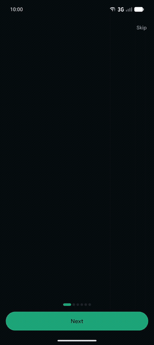
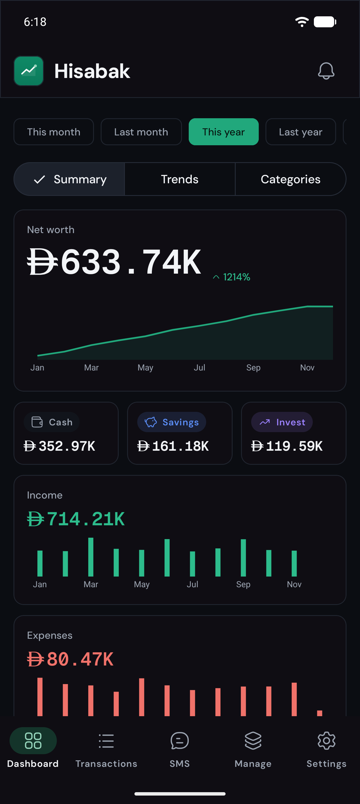
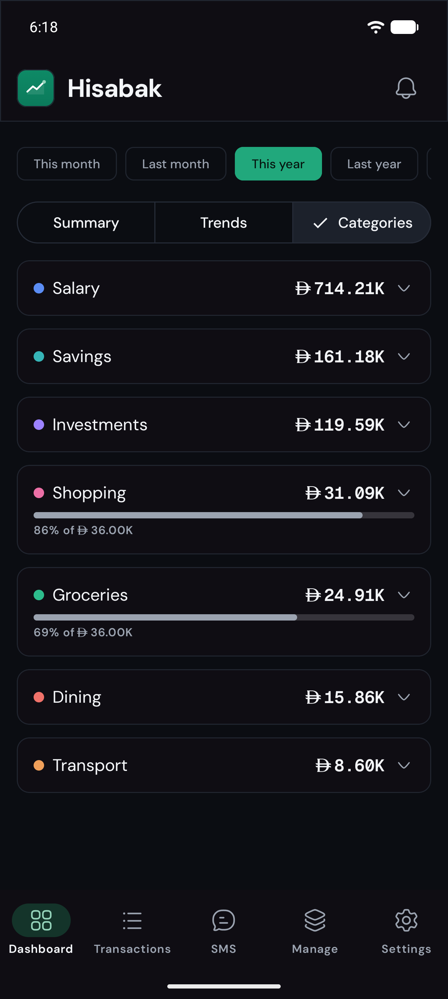
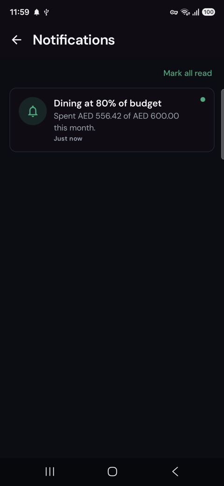
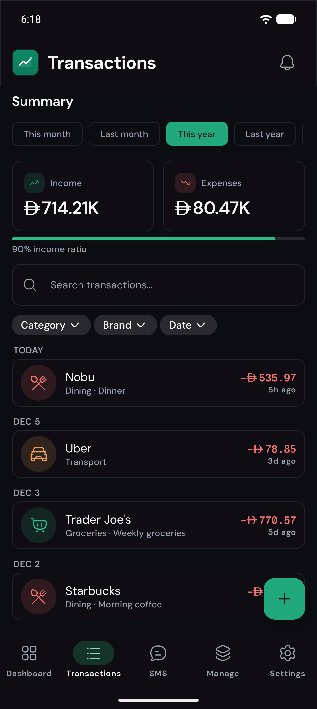
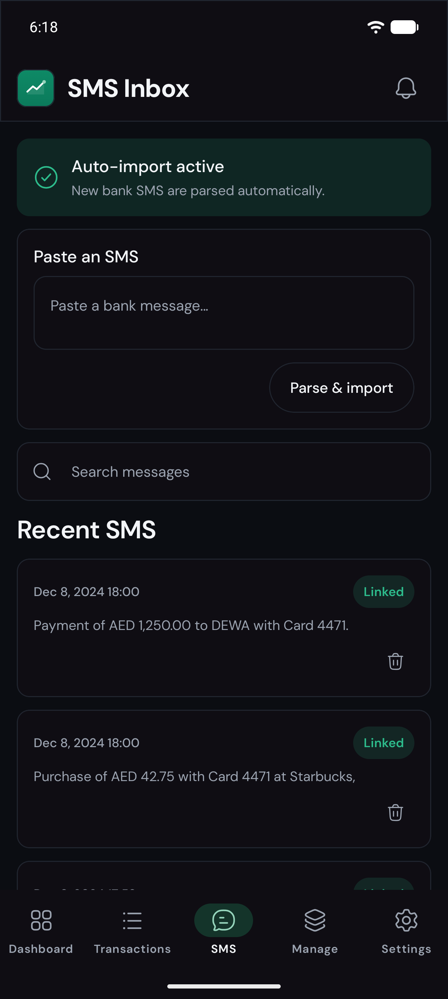
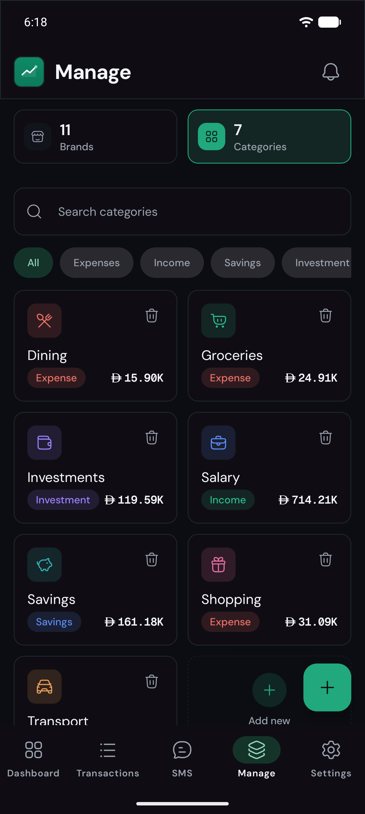

<p align="center">
  
</p>

<h1 align="center">Hisabak</h1>

<p align="center">
  A personal finance tracker for Android that turns your bank SMS alerts into a clean,
  organized view of your money — categorize spending, set monthly budgets, and get notified
  before you overshoot.
</p>

<p align="center">
  <a href="../../actions/workflows/test.yml"></a>
  <a href="../../releases"></a>
  
  
  
  
  
</p>

<p align="center">
  <b>🤖 Built entirely in plain English.</b><br>
  From idea and architecture to the Kotlin code, tests, CI/CD automation, the app icon and
  store graphics, the demo video, and the Play Store listing — the entire project was produced
  by <b>Claude Opus 4.8</b> via Claude Code. I directed and reviewed; Claude built it.
</p>

<p align="center">
  
</p>

<p align="center"><sub><i>A quick tour — dark theme.</i></sub></p>

---

## 📸 Screenshots

<table>
  <tr>
    <td align="center"><br><sub>Dashboard</sub></td>
    <td align="center"><br><sub>Budgets</sub></td>
    <td align="center"><br><sub>Budget alerts</sub></td>
  </tr>
  <tr>
    <td align="center"><br><sub>Transactions</sub></td>
    <td align="center"><br><sub>SMS inbox</sub></td>
    <td align="center"><br><sub>Manage</sub></td>
  </tr>
</table>

> Shown in dark theme. Light and dark are both first-class — every screen is designed for both.

---

## 📥 Download

Three ways to get it (Android 10+ / API 29):

- **Try the demo** — a build pre-loaded with sample data, so the dashboard, charts, and budgets
  are populated the moment you open it:
  **[install the demo](https://appdistribution.firebase.dev/i/b817bdd33c687f05)** via Firebase
  App Distribution (accept the invite, then install through the Firebase App Tester app).
- **Direct APK** — the production build (starter categories only, your data only): grab the latest
  `hisabak-*.apk` from the [**Releases**](../../releases) page, then open it on-device (allow
  "install unknown apps") or `adb install` it. A ~3 MB R8-minified, release-signed build.
- **Google Play** — coming soon (currently in internal testing).

---

## ✨ Features

Everything below is built and shipping today:

- [x] 🚀 **Guided onboarding** — a premium, animated first-launch walkthrough of the app's
  features, ending with an SMS-permission primer.
- [x] 💬 **SMS capture** — parse bank SMS into transactions automatically (with permission), or
  capture one on demand by sharing it into Hisabak, selecting its text → Hisabak, or pasting it.
- [x] 🔔 **Budgets with alerts** — set a monthly limit per category and get notified at **50% /
  80% / 100%**. Alerts arrive as an Android notification *and* an in-app entry; tapping one opens
  the dashboard with that category expanded.
- [x] 📊 **Dashboard** — net worth with cash / savings / investment breakdown, income & expense
  trends, category and brand breakdowns, and period filters (this/last month, this/last year, all
  time) across Summary, Trends, and Categories tabs.
- [x] 🧾 **Transactions** — searchable, filterable list (by brand, category, date range), with
  uncategorized spending surfaced for quick cleanup.
- [x] 🗂️ **Organize** — categories (income / expense / savings / investment) with colors and
  icons, and brands mapped to categories. Safe deletion with brand-merge and confirmation.
- [x] 🛎️ **Notifications center** — unread badge on the bell, swipe-to-dismiss, and mark-all-read.
- [x] ⚙️ **Settings** — pick your **theme** (light / dark / system) and **language**
  (**English / العربية**, fully localized and right-to-left). Both are saved across launches.
- [x] 📴 **Offline-first** — all data is stored locally on-device (Room). Light & dark themes,
  polished motion, edge-to-edge.

---

## 🗺️ Roadmap

What's next, roughly in order:

- [ ] 🛎️ **Notification capture** — read bank transaction notifications to capture spending without
  the SMS permission (works in the Play build).
- [ ] 💾 **Backup & restore** — export and import your data (encrypted), so you can move between
  devices.
- [ ] 💱 **Multi-currency** — track transactions and balances across more than one currency.
- [ ] 🔒 **App lock** — biometric / PIN lock to keep your finances private on a shared device.
- [ ] 🛡️ **Database encryption** — encrypt the on-device database at rest.
- [ ] 🤖 **AI capture & auto-categorization** — smarter SMS parsing and automatic brand → category
  detection.
- [ ] 💡 **AI insights assistant** — ask questions about your spending and get clear, on-point
  answers.
- [ ] ↩️ **Refunds** — record a refund against a transaction so returned money is reflected in
  balances and category spend.

> Privacy stays first: AI features will be designed to keep your data under your control.

---

## 🧰 Tech stack

- **Language:** Kotlin
- **UI:** Jetpack Compose + Material 3
- **Navigation:** Jetpack Navigation 3
- **Persistence:** Room (local, offline-first)
- **DI:** Koin
- **Async:** Coroutines + Flow
- **State:** ViewModel + `collectAsStateWithLifecycle`
- **Charts:** Vico
- **Crash reporting & analytics:** Firebase Crashlytics + Analytics (release builds only;
  disabled in debug; analytics events carry no personal or financial data)

---

## 🏗️ Architecture

Feature-by-layer, with clean architecture inside each feature:

```
com.hisabak
├── core/                                shared primitives (Money, Clock, DomainResult, Room db)
├── ui/                                  design system: theme, motion, shared components
└── feature/<name>/
    ├── domain/        entities, use cases, repository interfaces
    ├── data/          Room repository implementations + mappers
    └── presentation/  stateful Route + stateless Screen + ViewModel (MVI-style)
```

Budget alerts are driven by a small reactive engine (`CategoryLimitMonitor`) that observes
transactions and limits and fires once per threshold per category per month — so manually added
and SMS-imported transactions are both covered through a single path.

---

## 🧪 Testing & quality

The domain logic and ViewModels are covered by **116 JVM unit tests** (money math, the SMS
template parser, budget/limit logic, and ViewModel state) that run on the plain JVM — no
emulator needed:

```bash
./gradlew testProdDebugUnitTest
```

Quality is enforced, not just hoped for:

- **CI** — every pull request targeting `develop`/`main` runs the suite via GitHub Actions.
- **Branch protection** — a red suite can't be merged into the shared branches.
- **Auto-merge** — routine PRs into `develop` merge automatically once the suite passes;
  release PRs (`develop`→`main`) are merged deliberately by hand.
- **Local guard** — a pre-finish hook runs the tests on any change that touches Kotlin.

Tests use hand-written fakes over a small harness (`com.hisabak.testutil`) rather than a
mocking framework. See [`docs/testing.md`](docs/testing.md) for the full strategy.

---

## 🚀 Build & run

**Requirements:** Android Studio (latest stable), JDK 17, Android SDK. `minSdk 29`, `targetSdk 36`.

```bash
git clone https://github.com/ahmedalaishat/hisabak-android.git
cd hisabak-android
./gradlew installStagingDebug   # build & install the staging variant on a device/emulator
# or open the project in Android Studio and Run (pick the "stagingDebug" variant)
```

The app has two flavors with separate package names so they coexist on one device:
**production** (`com.hisabak`) and **staging** (`com.hisabak.staging`, labeled "Hisabak STG").
The **staging** build seeds demo data on first launch so the dashboard, charts, and budgets are
populated immediately; the **production** build seeds only a small set of starter categories
(no brands or transactions) so it's usable right away with your data only.

---

## 💡 Inspiration

Hisabak is inspired by [**Hisabi**](https://github.com/hisabi-app/hisabi) — a self-hosted Laravel
personal-finance web app by Saleem Hadad. The domain model (transactions, brands, categories,
budgets, SMS ingestion, dashboard metrics) mirrors Hisabi's so concepts map cleanly between the two.

---

## 📄 License

**Hisabak** is licensed under the **MIT License** — see [`LICENSE`](LICENSE) for details.

---

<p align="center">
  Built by <strong>Ahmad Alaishat</strong> · <a href="https://github.com/ahmedalaishat">GitHub</a> · <a href="https://www.linkedin.com/in/ahmedalaishat">LinkedIn</a>
</p>
